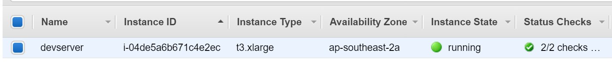
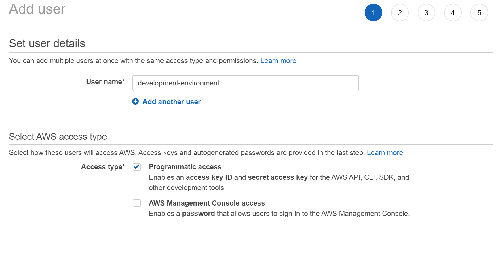
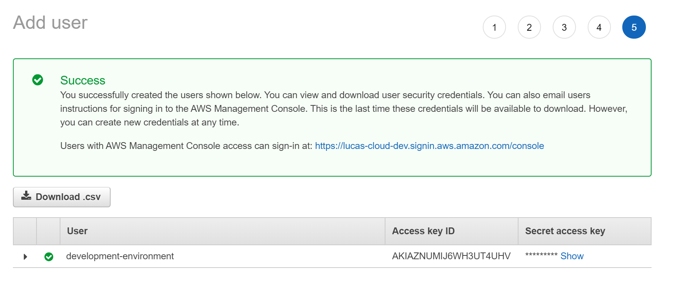

In the last few months I moved from my old Macbook Pro to a newer, much less powerful Surface Pro, in doing this I had to make several changes to the way I worked on projects and performed general development due to the lack of resources available on my now day-to-day machine.

Due to these contraints I needed a way to still perform my development work when my Surface Pro couldn't handle the stress (looking at you `node_modules/`). 

In my previous job I had used VSCode's SSH Plugin in order to work on a CentOS VM and was impressed with the speed and responsiveness of VSCode on a remote connection, because of this I set out to leverage VSCode and AWS to create a development environment that would only cost money for the time that it was in use.

## How it works

When running workloads on **AWS** using **EC2** you only pay for the Virtual Machine whilst it's on and in a running state, this means that whilst our server is *powered off* we won't need to pay the X cents an hour for the compute usage leaving us with just the storage costs (EBS). 

The downside to running an EC2 instance that is regularly off is that it will gain new public IP addresses on each boot which doesn't work well when you simply want to turn it on and start working, now you will need to change your config before each session. 

Due to this limitation I opted to use a static IP (EIP) from AWS and associate it with my Virtual Machine, performing this action costs money as AWS bill you for any IP's that you retain that aren't attached to a running instance however it's negligible and offers much more peace of mind. 

With your server all setup you can simply use VSCode's SSH Plugin to access the server as you would via Terminal and you will be greeted with your home directory on the remote server.

## Benefits

- Your development environment is now completely in the Cloud allowing you to use underpowered hardware without limitations, if it can run VSCode and SSH you can work on it.
- Due to your machine being in the Cloud your work is too, now you can swap devices without worry of spending large amounts of time setting up your device, instead you can jump straight into productivity.
- Performing backups of your environment is cheap, easy and pain-free.
- You can easily share you work by exposing a port, no longer do you need to worry about Ngrok or LocalTunnel or other middleman services.

## Setup

Below I written down the steps that I followed in order to create my development machine/environment, whilst these steps aren't concrete and will vary based on your needs they're a good starting point.

### Create an EC2 instance

The first step to creating our remote development environment is to create a server, for the purpose of this article we will be using **AWS Exclusively** however this should be compatible with other providers such as Azure and Google Cloud.

In order to create the EC2 instance simply log into your AWS account and navigate to the [EC2 Section](https://ap-southeast-2.console.aws.amazon.com/ec2/v2/home) from the dashboard.

Once on the EC2 dashboard we want to go to the Instances page and click on the **Launch Instance** option. From here we will be prompted for the operating system, any Linux distro is fine, in my case I used Amazon Linux 2 as it is their current LTS Linux flavour.

From there you can now pick your Instance Type, in my case I opted for a **t3.xlarge** as I really wanted to have enough power to multitask without worry (tmux, nodejs, golang, etc.), smaller instance types are also viable not that you're locked in as you can resize an instance whilst it's shutdown which our instance will be when it's not in active use.

Next up we need to place it into a Subnet and VPC for internet access, I will presume you already have a viable setup for this otherwise you can use the AWS defaults although you will be frowned upon by any Cloud Engineer. From there we can configure storage, I recommend starting with a conservative figure as it can always be expanded later on whereas shrinking a disk is troublesome at best. For this activity 20GB is a good starting point as it's more than enough room for the OS and several of the tools and runtimes developers will typically use.

Finally we can configure the Security Groups for our instance, whilst this is mostly up to the preference of the user I suggest opening your typical ports **(22, 80, 443)** and in addition opening the **3000-4000** range and then **8000-9000** range, this will provide enough available public ports for exposing services whilst also not leaving too many entrypoints open.

From there we should now see our instance spinning up in the AWS Console which we can connect to it via SSH using either the private key that you provided to AWS or the key it downloaded during provisioning.



### Setup the Linux Environment

This next step is relatively straightforward, we simply want to configure the machine to run SSH on ports 22 and 443 for those who are on restricted networks 443 is normally open for HTTPS connections whereas 22 is normally blocked for security.

In addition we will also add a cronjob for turning the machine off once it's been left idle since SSH connections can end unexpectedly as well as configuring SSH timeouts so you don't rack up large AWS bills for idling on the home directory.

So first and foremost let's configure SSH to run on ports 22 and 443, to do this simply open up `/etc/ssh/sshd_config` in your terminal text editor of choice, bear in mind this action will require root privileges so `sudo` is recommended. Once open change the port section until it looks like the following:

```ini
Port 22
Port 443
```

*File: /etc/ssh/ssdh_config*

Once completed save and exit the file and then restart the SSH service by running `sudo systemctl restart sshd` or `sudo service sshd restart` depending on your distro.

Next we will configure timeouts for SSH connections, once again open `/etc/ssh/sshd_config` and search for the line that contains `ClientAliveInterval` if this line isn't found simply add it to the bottom of the file. This configuration option takes in a number which references the number of seconds that a client can be idle for, in our case we will set this to 300 seconds (5 minutes).

```init
ClientAliveInterval 300
```

*File: /etc/ssh/sshd_config*

Finally we need a way to shut the machine down when it's been left idle with no active SSH sessions, I had experimented with PAM for this but found it to be unreliable in determining when to shutdown so I opted for the old reliable cronjob method.

The cronjob in question will run every 5 minutes and check if the server has been online for > 5 minutes and if there are any sessions active. If there aren't any and the server has been up for greater than 5 minutes it will issue a shutdown, the 5 minute uptime wait is so that the cron doesn't get triggered during startup and immediately shutdown.

To start copy the following script to `/opt/stop-instance.sh` and run `chmod +x /opt/stop-instance.sh` to make it executable:

```bash
#!/usr/bin/env bash

# Convenience function for logging information
function log() {
    echo "$(date +"%Y-%m-%d %H:%M:%S %z"): [$1] $2" | tee -a /var/log/stop-instance.log
}

log "DEBUG" "Script triggered, checking if shutdown should occur"

log "INFO" "Triggered by CRON"

# Get the uptime and extract the field which contains the seconds that have passed
UPTIME="$(cat /proc/uptime | cut -d' ' -f 1)"

log "INFO" "Uptime: $UPTIME"

# Pass our calculation to the basic calculator util which will return an appropriate exit code
# Checking if we have been online for greater than 5 minutes.
if [[ $(echo "$UPTIME > 300" | bc -l) ]]; then
    # If we have been online for over than 5 minutes, lets list the users currently running
    # and see if it's < 1
    if [[ $(who | wc -l) -lt 1 ]]; then
        log "INFO" "No active users, shutting down..."
        sudo shutdown 0
    else
        log "INFO" "Active user sessions found, keeping alive.."
        log "DEBUG" "User sessions $(who)"
    fi
fi
```

*File: /opt/stop-instance.sh*

Next we need to setup the cronjob that will run this script, to do so we're going to use crontab. To do this run `sudo crontab -e`, you should now see an editor with cronjobs for the root user. Once on this screen we will past in the following cronjob at the bottom of the file:

```
*/5 * * * * /opt/stop-instance.sh &> /tmp/cron.log
```

Save and exit the editor and now we will have the server automatically shutting down when we aren't actively connected to it via SSH, no longer will we have to fear the AWS bills.

### Automate the starting of our environment

Currently when we want to use the environment we need to log into the AWS console and start it there, this is annoying as it can add several extra steps that we aren't interested in performing each time we want to work. 

It would be nice if we could simply run something like `start-dev-environment` and have it perform those actions for us and then start an SSH connection.

To do this we will need to provision a set of tokens from AWS and install the AWS CLI. For the first part we can navigate to [AWS' IAM (Identity and Access Management) section](https://console.aws.amazon.com/iam/home), from there navigate to the users dashboard and add a user.



This user will only require programatic access as it will be used with our automation script, from there we can just attach permissions directly to the user with it requiring **EC2FullAccess** from there continue on to create the user and note down it's Access Key and Secret Access Key.



Now with the Access Key and Secret Access Key we can use the following script:

```bash
#!/usr/bin/env bash

function log() {
    echo "$(date +"%Y-%m-%d %H:%I:%S %z"): [$1] $2"
}


aws --help &> /dev/null

if [[ $? != 0 ]]; then
    log "ERROR" "awscli is not installed, please install it via your distributions package manager.."
fi

if [[ $PERSONAL_AWS_ACCESS_KEY_ID == "" ]]; then
    log "ERROR" "PERSONAL_AWS_ACCESS_KEY_ID not defined, please set PERSONAL_AWS_ACCESS_KEY_ID and try again.."
    exit 1
fi

if [[ $PERSONAL_AWS_SECRET_KEY == "" ]]; then
    log "ERROR" "PERSONAL_AWS_SECRET_KEY not defined, please set PERSONAL_AWS_SECRET_KEY and try again.."
    exit 1
fi

if [[ $AWS_SERVER_INSTANCE_ID == "" ]]; then
    log "ERROR" "AWS_SERVER_INSTANCE_ID not defined, please set AWS_SERVER and try again.."
    exit 1
fi

if [[ $AWS_SERVER_SSH_ALIAS == "" ]]; then
    log "ERROR" "AWS_SERVER_SSH_ALIAS not defined, please set AWS_SERVER_SSH_ALIAS and try again.."
    exit 1
fi

if [[ $AWS_DEFAULT_REGION == "" ]]; then
  log "WARNING" "AWS_DEFAULT_REGION not set, defaulting to ap-southeast-2..."
  
  AWS_DEFAULT_REGION="ap-southeast-2"
fi

log "INFO" "Making API request to start server.."

AWS_ACCESS_KEY_ID="$PERSONAL_AWS_ACCESS_KEY_ID"
AWS_SECRET_ACCESS_KEY="$PERSONAL_AWS_SECRET_KEY"

echo "ACCESS_KEY: $AWS_ACCESS_KEY_ID"
echo "SECRET_KEY: $AWS_SECRET_ACCESS_KEY"

aws ec2 start-instances --instance-ids $AWS_SERVER_INSTANCE_ID

log "INFO" "API Reponse: $RESPONSE"

log "INFO" "Waiting for server to start.."
sleep 30

log "INFO" "Starting SSH Connection.."

if [[ $SSH_ALTERNATE_PORT != "" ]]; then
    ssh $1 -p $SSH_ALTERNATE_PORT "$AWS_SERVER_SSH_ALIAS"
else
    ssh $1 "$AWS_SERVER_SSH_ALIAS"
fi
```
*File: /usr/local/bin/start-development-environment*

I recommend you save this to your home directory as `start-development-environment.sh`, from there run `chmod +x start-development-environment.sh` to make it executable and then run `sudo mv start-development-environment.sh /usr/local/bin/start-development-environment` to make it globally available as `start-development-environment`.

In addition this will require AWS CLI to be installed, this will typically be in your distributions package manager so try performing an `apt-get install awscli` or `yum install awscli`.

Once completed we will need to configure our bash profile to contain the required environment variables for the script, to do so append the following values to the end of your `.bash_profile` or `.bashrc`

```bash
export PERSONAL_AWS_ACCESS_KEY_ID='<ACCESS_KEY>'
export PERSONAL_AWS_SECRET_KEY='<SECRET_ACCESS_KEY>'
export AWS_SERVER_INSTANCE_ID='<INSTANCE_ID>'
export AWS_SERVER_SSH_ALIAS="<ALIAS>" 
```

In addition we will need to create an SSH alias for our development environment, this will allow us to configure once and use everywhere, to do so add the following to your `~/.ssh/config`

```
Host <ALIAS>
    HostName <INSTANCE_IP>
    User ec2-user
    Port 22
```

Once completed running `start-development-environment` should now start our server and perform an SSH connection to it. Using the same config we can also connect remotely via VSCode and with that we now have an incredibly portable development environment.